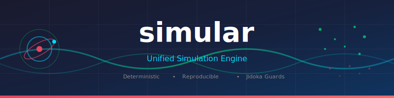

<div align="center">

<p align="center">
  
</p>

<h1 align="center">simular</h1>

<p align="center">
  <b>A unified simulation engine for deterministic, reproducible simulations in Rust.</b>
</p>

<p align="center">
  <a href="https://crates.io/crates/simular"></a>
  <a href="https://docs.rs/simular"></a>
  <a href="https://github.com/paiml/simular/actions/workflows/ci.yml"></a>
  <a href="https://opensource.org/licenses/MIT"></a>
</p>

</div>

---

Simular provides a unified framework for physics, Monte Carlo, optimization, and ML simulations with guaranteed reproducibility. Built on Toyota Production System principles (Jidoka, Poka-Yoke) for mission-critical quality.

## Features

- **Deterministic** — Same seed = bit-identical results across platforms
- **Jidoka Guards** — Automatic anomaly detection (NaN, energy drift, constraint violations)
- **Multiple Domains** — Physics, Monte Carlo, Bayesian optimization, ML training
- **Pre-built Scenarios** — Rocket, satellite, pendulum, climate, portfolio, epidemic
- **Variance Reduction** — Antithetic, control variates, importance sampling, stratified

## Installation

```toml
[dependencies]
simular = "0.1"
```

## Quick Start

### Monte Carlo Pi Estimation

```rust
use simular::prelude::*;
use simular::domains::monte_carlo::MonteCarloEngine;

let mut rng = SimRng::new(42);  // Deterministic!
let engine = MonteCarloEngine::with_samples(100_000);

let result = engine.run_nd(2, |x| {
    if x[0]*x[0] + x[1]*x[1] <= 1.0 { 4.0 } else { 0.0 }
}, &mut rng);

println!("π ≈ {:.6} ± {:.6}", result.estimate, result.std_error);
```

### Physics Simulation

```rust
use simular::domains::physics::{PhysicsEngine, GravityField, VerletIntegrator};
use simular::engine::state::{SimState, Vec3};

let mut state = SimState::new();
state.add_body(1.0, Vec3::new(0.0, 0.0, 100.0), Vec3::new(10.0, 0.0, 20.0));

let engine = PhysicsEngine::new(GravityField::default(), VerletIntegrator::new());

for _ in 0..1000 {
    engine.step(&mut state, 0.01)?;
}
```

### Bayesian Optimization

```rust
use simular::domains::optimization::{BayesianOptimizer, OptimizerConfig};

let config = OptimizerConfig {
    bounds: vec![(-2.0, 2.0), (-2.0, 2.0)],
    seed: 42,
    ..Default::default()
};

let mut optimizer = BayesianOptimizer::new(config);

for _ in 0..20 {
    let x = optimizer.suggest();
    let y = rosenbrock(&x);
    optimizer.observe(x, y)?;
}

let (best_x, best_y) = optimizer.best().unwrap();
```

## Examples

```bash
cargo run --example monte_carlo        # Pi estimation
cargo run --example physics_simulation # Projectile motion
cargo run --example optimization       # Bayesian optimization
cargo run --example reproducibility    # Determinism demo
cargo run --example jidoka_guards      # Anomaly detection
```

## Domains

| Domain | Description | Key Types |
|--------|-------------|-----------|
| **Physics** | Rigid body dynamics | `PhysicsEngine`, `VerletIntegrator`, `RK4Integrator` |
| **Monte Carlo** | Stochastic sampling | `MonteCarloEngine`, `VarianceReduction` |
| **Optimization** | Bayesian optimization | `BayesianOptimizer`, `GaussianProcess` |
| **ML** | Training simulation | `TrainingSimulation`, `AnomalyDetector` |

## Scenarios

| Scenario | Description |
|----------|-------------|
| `RocketScenario` | Multi-stage launch simulation |
| `SatelliteScenario` | Orbital mechanics |
| `PendulumScenario` | Classical mechanics |
| `ClimateScenario` | Energy balance models |
| `PortfolioScenario` | VaR/CVaR calculations |
| `SIRScenario` | Epidemic modeling |

## Jidoka Guards

Automatic anomaly detection inspired by Toyota's Jidoka principle:

```rust
use simular::engine::jidoka::{JidokaConfig, JidokaGuard};

let config = JidokaConfig {
    check_finite: true,      // Detect NaN/Inf
    check_energy: true,      // Monitor conservation
    energy_tolerance: 1e-6,
    ..Default::default()
};

let mut guard = JidokaGuard::new(config);

// After each simulation step
match guard.check(&state) {
    Ok(()) => { /* continue */ }
    Err(violation) => { /* handle anomaly */ }
}
```

## Documentation

- [Book](./book/) — Comprehensive guide with examples
- [API Reference](https://docs.rs/simular) — Full API documentation

Build the book locally:
```bash
cd book && mdbook build && mdbook serve
```

## Architecture

```
simular
├── engine/           # Core: SimState, SimRng, JidokaGuard
├── domains/          # Physics, Monte Carlo, Optimization, ML
├── scenarios/        # Pre-built: Rocket, Satellite, Pendulum, etc.
├── replay/           # Record and replay simulations
└── visualization/    # TUI and Web interfaces
```

## Contributing

Contributions welcome! Please read our contributing guidelines and ensure all tests pass:

```bash
cargo test
cargo clippy -- -D warnings
```

## License

MIT License - see [LICENSE](LICENSE) for details.
