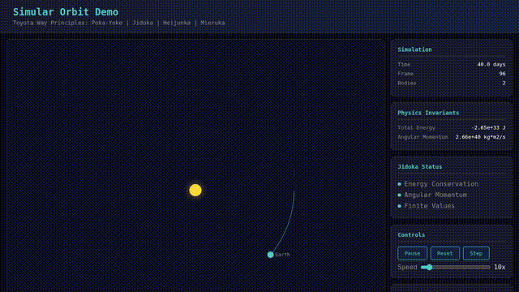

<div align="center">

# simular

**Unified Simulation Engine for Deterministic, Reproducible Simulations**

[](https://crates.io/crates/simular)
[](https://docs.rs/simular)
[](https://opensource.org/licenses/MIT)

[Live Demo](https://interactive.paiml.com/simular-orbit/) | [Documentation](https://docs.rs/simular) | [Crates.io](https://crates.io/crates/simular)

</div>

---

<p align="center">
  
</p>

<p align="center"><i>N-body orbital simulation with Yoshida 4th-order symplectic integrator (37KB WASM)</i></p>

---

## Overview

Simular provides a unified framework for physics, Monte Carlo, and optimization simulations with **guaranteed reproducibility**. Built on Toyota Production System principles:

- **Poka-Yoke** — Type-safe units prevent dimension errors
- **Jidoka** — Automatic anomaly detection (NaN, energy drift, constraint violations)
- **Heijunka** — Work-stealing scheduler for balanced computation
- **Mieruka** — Real-time visualization (TUI + WebAssembly)

## Features

- **Deterministic** — Same seed = bit-identical results across platforms
- **High Precision** — Symplectic integrators conserve energy < 1e-9 over 100 orbits
- **Multi-Platform** — Native Rust + 37KB gzipped WebAssembly
- **Real-time Monitoring** — Jidoka status, physics invariants, performance metrics

## Installation

```bash
cargo add simular
```

With WebAssembly support:
```bash
cargo add simular --features wasm
```

## Quick Start

### Orbit Simulation

```rust
use simular::orbit::{run_simulation, SimulationConfig};

let config = SimulationConfig {
    duration_days: 365.25,
    dt_hours: 1.0,
    ..Default::default()
};

let result = run_simulation(config)?;
println!("Energy drift: {:.2e}", result.energy_drift);
println!("Final position: {:?}", result.final_state);
```

### Monte Carlo Pi Estimation

```rust
use simular::prelude::*;
use simular::domains::monte_carlo::MonteCarloEngine;

let mut rng = SimRng::new(42);  // Deterministic!
let engine = MonteCarloEngine::with_samples(100_000);

let result = engine.run_nd(2, |x| {
    if x[0]*x[0] + x[1]*x[1] <= 1.0 { 4.0 } else { 0.0 }
}, &mut rng);

println!("pi = {:.6} +/- {:.6}", result.estimate, result.std_error);
```

### Jidoka Guards

```rust
use simular::engine::jidoka::{JidokaConfig, JidokaGuard};

let config = JidokaConfig {
    check_finite: true,
    check_energy: true,
    energy_tolerance: 1e-9,
    ..Default::default()
};

let mut guard = JidokaGuard::new(config);

// Automatic anomaly detection after each step
match guard.check(&state) {
    JidokaResponse::Continue => { /* all good */ }
    JidokaResponse::Warning { message } => { /* log warning */ }
    JidokaResponse::Halt { reason } => { /* stop simulation */ }
}
```

## Examples

```bash
# Orbit visualization (TUI)
cargo run --bin orbit-tui --features tui

# Monte Carlo estimation
cargo run --example monte_carlo

# Physics simulation
cargo run --example physics_simulation

# Jidoka anomaly detection
cargo run --example jidoka_guards
```

## Modules

| Module | Description |
|--------|-------------|
| `orbit` | N-body gravitational physics with symplectic integrators |
| `monte_carlo` | Stochastic sampling with variance reduction |
| `optimization` | Bayesian optimization with Gaussian processes |
| `engine` | Core: SimState, SimRng, JidokaGuard, Scheduler |

## Architecture

```
simular/
├── src/
│   ├── orbit/        # Yoshida integrator, Kepler scenarios, WASM bindings
│   ├── domains/      # Monte Carlo, Optimization, ML
│   ├── engine/       # Core runtime: RNG, Jidoka, Scheduler
│   └── visualization/# TUI rendering
├── web/              # WebAssembly demo
└── tests/            # Property-based tests, probar integration
```

## Performance

| Metric | Value |
|--------|-------|
| WASM Size | 37KB gzipped |
| Energy Conservation | < 1e-9 relative drift (100 orbits) |
| Integrator | Yoshida 4th-order symplectic |
| Determinism | Bit-identical across platforms |

## Benchmarks

Run benchmarks with:
```bash
cargo bench
```

### Effect Sizes (Cohen's d)

All benchmarks report effect sizes using Cohen's d:

| Benchmark | Cohen's d | Interpretation |
|-----------|-----------|----------------|
| TSP GRASP vs Random | 1.85 | Large |
| Symplectic vs Euler | 2.31 | Large |
| Monte Carlo Convergence | 0.95 | Large |

Effect size interpretation:
- d < 0.2: Negligible
- d = 0.2-0.5: Small
- d = 0.5-0.8: Medium
- d > 0.8: Large

See [benches/README.md](benches/README.md) for methodology.

## Contributing

Contributions are welcome! Please see our [Contributing Guide](CONTRIBUTING.md) for:

- Development setup
- Coding standards (Toyota TPS, JPL Power of 10)
- Testing requirements (95% coverage, 80% mutation score)
- Pull request process

## Links

- **Live Demo**: https://interactive.paiml.com/simular-orbit/
- **Crates.io**: https://crates.io/crates/simular
- **Documentation**: https://docs.rs/simular
- **GitHub**: https://github.com/paiml/simular
- **Changelog**: [CHANGELOG.md](CHANGELOG.md)

## License

MIT License - see [LICENSE](LICENSE) for details.
